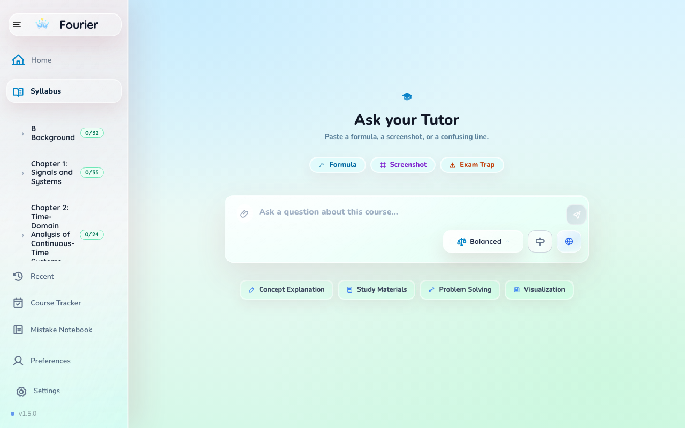
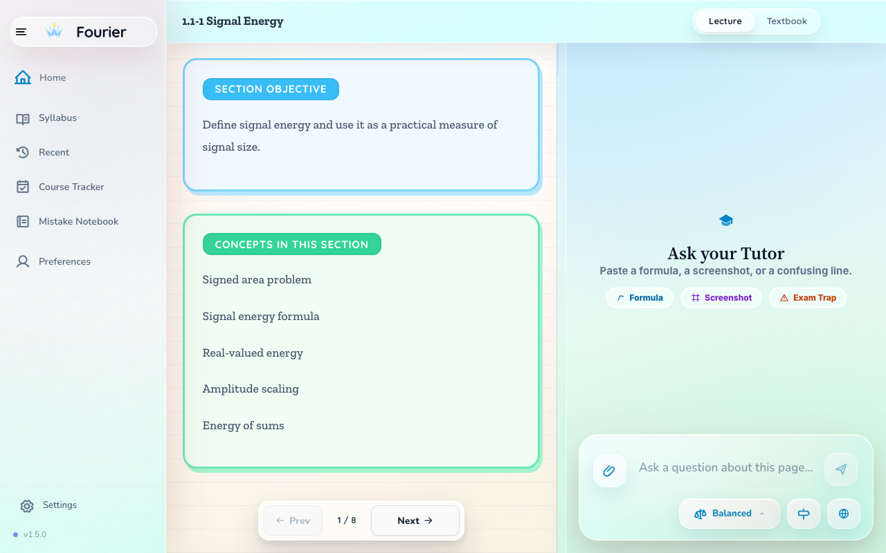
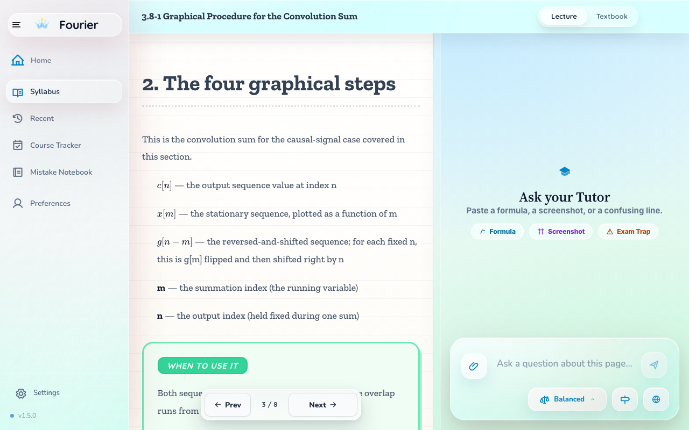
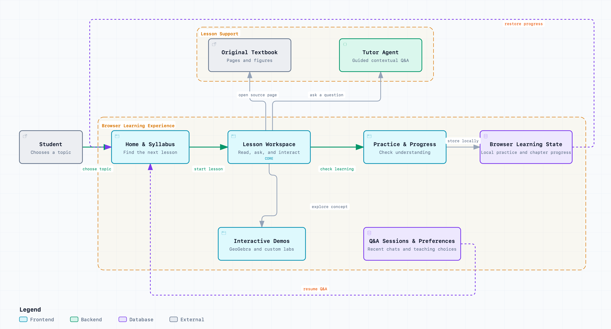
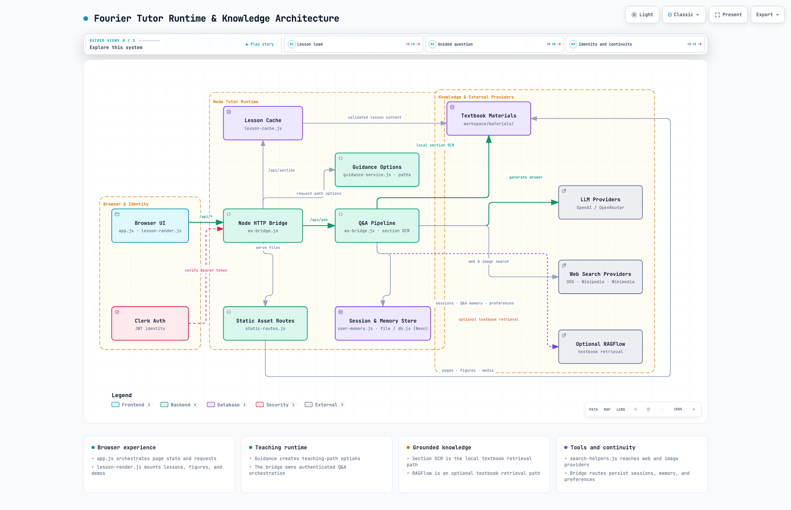

# Fourier Tutor Agent

An interactive full-stack tutor for learning signal processing
through textbook-grounded lessons, guided Q&A, and visual demos.

**Stack:** Node.js · Vanilla JavaScript · PostgreSQL / Neon · Playwright

## See the Product

### Home & Syllabus

Choose a topic and find the next lesson.



### Lesson Workspace

Read source material, ask the Tutor Agent, and stay in context.



### Interactive Demo

Manipulate signals and make convolution visible.



## Product Architecture

From topic selection to lesson interaction, practice, and progress continuity.



[Open the editable architecture source](docs/architecture/learning-experience.architecture.html)

## What You Can Do

- **Learn from the textbook** — Read structured lessons with original pages and figures close at hand.
- **Ask the Tutor Agent** — Get contextual explanations grounded in the current lesson and source material.
- **Explore with interactive demos** — Manipulate signals and see concepts such as convolution change visually.
- **Keep your learning loop** — Practice, track chapter progress, and resume recent Q&A sessions.

Choose a topic → Open a lesson → Read, ask, and interact → Practice → Resume

## Engineering Highlights

- **Browser-first UI** — Vanilla JavaScript coordinates lessons, demos, Q&A, practice, and responsive layout.
- **Textbook-grounded content** — The unified lesson cache ties lesson content to textbook pages, figures, and OCR.
- **Contextual Q&A pipeline** — Guidance options are generated first; the selected question then flows through retrieval and `/api/ask`.
- **Clear persistence boundaries** — Browser storage holds practice and chapter progress; authenticated Q&A sessions and preferences use server storage.
- **Regression-focused delivery** — Node checks, contract tests, Playwright flows, and visual baselines protect the learning experience.

```text
Browser UI → Node HTTP Bridge → Lesson Cache / Q&A Pipeline
           → Textbook Materials + LLM Providers → Browser State
```

<details>
<summary>Runtime and knowledge architecture</summary>



[Open the editable runtime architecture source](docs/architecture/runtime-knowledge.architecture.html)

</details>

## Run Locally

```bash
npm install
npm start
```

- Web UI: `http://127.0.0.1:9000`
- Health check: `http://127.0.0.1:9000/health`

Optional provider keys can be configured through environment variables. See [`app/.env.example`](app/.env.example).

## Explore the Code

```text
app/                    Browser UI, API bridge, lesson renderer, demos
workspace/materials/    Textbook pages, OCR, figures, lesson cache
tools/                  Contract tests, Playwright flows, visual baselines
docs/architecture/      Editable architecture sources and exported diagrams
```

- Start with [`app/index.html`](app/index.html) and [`app/app.js`](app/app.js) for the product flow.
- Follow [`app/ws-bridge.js`](app/ws-bridge.js) for API routing and Q&A orchestration.
- Open [`docs/architecture/`](docs/architecture/) for the product and runtime diagrams.

## Verification

```bash
npm run check
npm run test:guidance-ui
npm run test:geogebra
```

## Documentation

- [Product architecture](docs/architecture/learning-experience.architecture.html)
- [Runtime and knowledge architecture](docs/architecture/runtime-knowledge.architecture.html)
